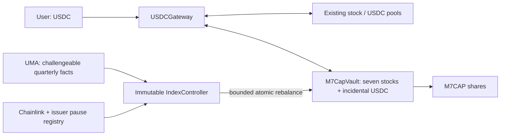

# M7CAP — a helper for direct indexing

M7CAP turns a seven-stock Coinbase basket on Base into one transferable ERC-20 receipt. A user supplies USDC; the gateway buys the required constituent quantities, deposits them in the vault, and mints M7CAP. Redemption reverses that process. Each share represents the same proportion of the actual basket.

This repository implements the contracts and operating tools. It has **not been deployed or independently audited**. Live Base integration was tested on a local fork with native B20 execution; no live funds were spent. Initial, independently reviewed company-cap observations and operational oracle monitoring are still required before launch.

## Run it

Requirements: Foundry (tested with Forge 1.5.1), Python 3.9+, and Git for fetching pinned dependencies. No Node packages are required.

```sh
make deps
make check
```

`make check` builds the contracts, checks formatting, and runs Solidity and Python tests. The live-state fork test explicitly skips unless opted in. Solidity is pinned to 0.8.30; dependencies are OpenZeppelin 5.4.0 and forge-std 1.9.7.

For native B20 integration, use [Base's Foundry build](https://github.com/base/base-anvil/releases/tag/v1.1.0), which contains the Base precompiles. Its executable is named `forge`; keep it separate from ordinary Foundry:

```sh
BASE_FORK_TEST=true BASE_FORK_BLOCK=51830602 FOUNDRY_BASE=true \
  "$BASE_FORGE" test --match-contract BaseForkTest -vv
```

`BASE_FORGE` is the path to the Base-aware binary. `BASE_RPC_URL` optionally selects an archive-capable Base endpoint. This command mutates only a local fork, buys the seven B20s from their actual pools, and exercises the real vault and gateway. It neither fabricates B20 balances nor broadcasts transactions. The equal-dollar test seed exercises routing; it is not the proposed market-cap allocation.

Run current read-only integration checks separately:

```sh
python3 scripts/verify_base.py
```

An exit status of 1 on stale weekend feeds is expected. The JSON distinguishes integration reads from rebalance eligibility. Historical addresses, source provenance, pool identities, and quotes are in [config/base.json](config/base.json) and [docs/INTEGRATION.md](docs/INTEGRATION.md).

## Contracts and invariants



- **M7CapVault:** ERC-20 shares plus asset custody. For current balance `B[i]`, supply `S`, and shares `q`, minting collects `ceil(B[i]*q/S)` and redemption returns `floor(B[i]*q/S)`. Actual holdings include incidental USDC, preventing cash from becoming unaccounted backing. Shares mint only after exact transfers succeed. In-kind transactions need no price oracle.
- **USDCGateway:** exact-output purchases for a requested share count and exact-input sales for redemptions. Routes are direct verified Slipstream stock/USDC pools; the caller provides seven tick spacings, currently all `10`. The total spending ceiling or minimum proceeds protects execution. Unspent USDC returns to the caller. Existing gateway donations cannot be spent or claimed by another caller.
- **IndexController:** accepts current-quarter quantity-ratio assertions through UMA, then lets anyone execute one accepted rebalance in that quarter. The full batch must preserve supply, lose no more than 50 bps of reference NAV, finish within 25 absolute bps of each target weight, retain every stock, and leave at most 1 bp in cash. There are no arbitrary calls, project admin, upgrade keys, or asset-withdrawal functions.
- **Valuation:** reads total-return feeds once per rebalance and uses that same snapshot for pre/post values. Multipliers are not applied twice. Rebalancing requires issuer feeds unpaused, the sequencer healthy beyond a 1-hour grace period, stock prices at most 1 hour old, and USDC at most 25 hours old. Execution is limited to weekdays 15:00–17:00 UTC. Because stock feeds have 24-hour heartbeats, quiet markets may offer limited execution windows; the contracts fail closed.

Canonical asset order is **AAPLc, AMZNc, GOOGLc, METAc, MSFTc, NVDAc, TSLAc, USDC**. Stocks have 8 decimals, USDC has 6, M7CAP has 18. M7CAP uses standard ERC-20; B20 is the underlying stock format, not the index accounting mechanism. The core intentionally does not advertise ERC-4626 compliance.

All eight-token operations are atomic. A blocked constituent or unfillable swap reverts the entire USDC operation. In-kind exits remain possible only when the required transfers succeed. A fully seized-to-zero stock stops new issuance; redemptions reflect remaining holdings. Partial frozen-asset claims are not implemented.

The initial bootstrap issues 1,000 M7CAP against the supplied basket, permanently locking `0.000001` shares at address `0x01`. The rest goes to the seed receiver. The seed funder may initialize only once and has no subsequent authority. The initial share price depends on actual backing, not a guaranteed $1 peg.

## User API

Approve USDC to the gateway for purchases, and M7CAP to the gateway for redemptions. For direct in-kind issuance, approve each component to the vault. `deadline` is a Unix timestamp. Limits use raw token units.

```solidity
vault.quoteMint(sharesOut);               // uint256[8] proportional component inputs
vault.mintBasket(sharesOut, maxAmounts, receiver, deadline);
vault.quoteRedeem(sharesIn);              // uint256[8] component outputs
vault.redeemBasket(sharesIn, minAmounts, receiver, deadline);

gateway.mintWithUSDC(sharesOut, maxUSDCIn, receiver, deadline, tickSpacings);
gateway.redeemToUSDC(sharesIn, minUSDCOut, receiver, deadline, tickSpacings);
```

The gateway returns actual USDC spent/received. Obtain executable quotes for the vault's current component quantities; a Chainlink reference price is not an executable quote. A USDC-budget UI chooses a share quantity that fits the budget, sets its spending ceiling, and receives any refund. There is no project fee, yield strategy, queue, or dedicated M7CAP liquidity pool. Existing DEX fees, price impact, gas, and issuer economics still apply.

## Index maintenance

Read [the immutable methodology](docs/METHODOLOGY.md) before constructing observations. It specifies full company capitalization, Alphabet/Meta share classes, quarter-end cutoff, share-count adjustments, matched price/multiplier dates, and exact rounding. Price movements change weights naturally between quarterly reviews; the strategy does not continuously restore stale percentage weights.

```sh
python3 scripts/index_snapshot.py observations.json > config/snapshot.json
```

The compiler validates structure and arithmetic, not source truth. Publish the observations and output in an immutable evidence bundle. Initial observations are deliberately not fabricated from stock-token supply or substituted with equal weights.

Anyone can propose, settle, or execute. Example simulation commands, after setting the addresses from `.env.example`:

```sh
FOUNDRY_BASE=true "$BASE_FORGE" script script/Maintain.s.sol:Propose --rpc-url "$BASE_RPC_URL"
FOUNDRY_BASE=true "$BASE_FORGE" script script/Maintain.s.sol:Settle --rpc-url "$BASE_RPC_URL"
FOUNDRY_BASE=true "$BASE_FORGE" script script/Maintain.s.sol:Execute --rpc-url "$BASE_RPC_URL"
```

Independently compile the expected snapshot and inspect the current assertion with:

```sh
python3 scripts/watch_index.py --controller "$CONTROLLER" --rpc-url "$BASE_RPC_URL" \
  --expected-snapshot config/snapshot.json
```

This one-shot monitor reports exact ratio differences, missing quarterly execution, UMA disputes, and challenge expiry. Exit codes are 0 for a matched/executed state, 1 for operational alerts, and 2 for failed reads. It never fetches evidence URLs or submits disputes. Run it under an external scheduler with alert delivery and independent source review; a successful comparison does not establish that either snapshot is truthful.

The proposal script reads `config/snapshot.json`, `CONTROLLER`, `PROPOSER`, and `EVIDENCE_URI`. The settle script uses `EXECUTOR` and `ASSERTION_ID`. Execute reads `config/rebalance.json`: `controller`, `chain_id`, `quarter_id`, `deadline`, `swap_count`, and a `swaps` array with `token_in`, `token_out`, `tick_spacing`, `amount_in`, and `min_amount_out` per leg. Stock sales and purchases route through USDC; the batch has at most 14 legs. Quantities and minimum outputs must be freshly quoted, and simulations must pass before broadcasting.

The proposer posts `max(UMA current minimum, immutable bond floor)`; a successful assertion returns the bond to its proposer through UMA. The deployment script defaults the floor to 1,000 USDC, separate from the approximately $1,000 seed backing. Independent reviewers need dispute capital and must monitor the entire 72-hour challenge window. The floor does not automatically grow with TVL. This is an economic security parameter, not a guarantee that false facts will be challenged.

Assertions explicitly use UMA's supported `ASSERT_TRUTH2` identifier. The deployed oracle's `defaultIdentifier()` still returns deprecated `ASSERT_TRUTH`; using that default makes proposals revert. The native fork test caught this incompatibility, and the preflight checks the actual identifier and collateral whitelists. See [UMA's identifier migration](https://docs.uma.xyz/resources/approved-price-identifiers).

A pending dispute can block that quarter's update until resolved. A rejected proposal permits a retry. An accepted but unexecuted proposal expires for execution at the next quarter boundary; the following quarter can receive a new proposal. Holdings and permitted in-kind exits remain intact when updates stall. Bonds can still be settled after quarter-end.

## Deployment workflow

`script/Deploy.s.sol` reads the canonical Base manifest and hashes the exact bytes of `docs/METHODOLOGY.md`. It predicts the vault's CREATE address to bind the controller immutably without an admin setter. Keep the deployer's transaction nonce unchanged between final simulation and the deployment sequence.

```sh
FOUNDRY_BASE=true "$BASE_FORGE" script script/Deploy.s.sol:Deploy --rpc-url "$BASE_RPC_URL"
```

This is a simulation unless `--broadcast` is explicitly added. No production deployment was performed during implementation. Use a Foundry keystore or hardware wallet for an independently reviewed deployment; no private key is required by the repository's test or read tools.

After acquiring the reviewed seven-stock seed basket, copy `config/seed.example.json` to `config/seed.json`, fill the actual vault, receiver, and raw amounts, and simulate `script/Bootstrap.s.sol:Bootstrap`. Bootstrap transfers all seven assets and issues the initial shares atomically. The approvals may occur in preceding transactions. Public minting remains unavailable until bootstrap succeeds.

Before launch, complete sourced cap-weight observations, independent security review, issuer/wrapper distribution review, actual-address policy checks, current liquidity and feed validation, and independent UMA monitoring. The generic contracts cannot eliminate issuer freeze/seizure, custody, oracle, or Base dependencies. A replaced stock token, retired feed, or unsupported corporate event may require a new deployment and voluntary migration.

## Validation coverage

Tests cover seed/rounding/donation behavior, pro-rata non-dilution, mixed decimals, refunds and donation isolation, atomic failed swaps and transfer restrictions, reentrancy, route allowlists, assertion bonds/disputes, Gregorian quarter boundaries, stale/paused feeds, USDC depeg, sequencer recovery, target drift, and batch-wide loss limits. The native Base fork additionally tests real B20 transfers, approvals, actual pool routing, and complete USDC entry/exit.

The helper pools assets into one receipt; it does not provide separately registered brokerage positions or per-stock tax-lot control to each holder. Its legal status and distribution depend on the final product structure and applicable issuer terms.
