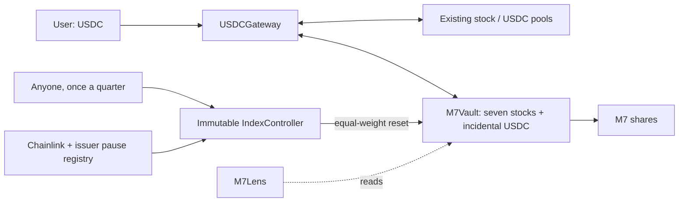

# M7 — a programmable MAG7 index

M7 is free software for an equal-weight basket of the Magnificent Seven stocks on Base: Apple, Amazon, Alphabet, Meta, Microsoft, NVIDIA, and Tesla. One ERC-20 token represents a proportional share of the vault's underlying Coinbase stock tokens and incidental USDC. The contracts target one-seventh of stock value per company through permissionless quarterly resets.

[Website](https://m7token.xyz) · [Website source](ui/) · [Methodology](docs/METHODOLOGY.md) · [Architecture](docs/ARCHITECTURE-REVIEW.md) · [Contributing](CONTRIBUTING.md)

## Why M7 exists

An equal-weight basket is a rule that software can execute. M7 explores a decentralized, programmable alternative to ETF products: transparent basket accounting, direct minting and redemption, and a rebalance policy enforced by contracts instead of a discretionary fund manager.

The goal is to bring the cost of running a simple index down by orders of magnitude. A recurring charge of 0.3% or 0.6% of assets grows with the capital held, even when the portfolio rule stays the same. M7 removes that recurring management fee entirely. It pays for execution when work is performed, including a bounded reward for whoever runs a reset.

Programmability matters as much as cost. Applications can read the backing, quote basket quantities, mint, redeem, and trigger eligible resets through public contract interfaces. Developers can build their own interfaces and integrations, or fork the software. Integrations must account for the underlying issuers' transfer policies; ERC-20 compatibility alone does not guarantee that every pool, bridge, or lending protocol can hold M7.

M7 has no administrator, owner privileges, or upgrade key. Full decentralization is the goal; the current system still depends on stock issuers and their custody and transfer controls, price feeds, liquidity pools, and Base. M7 is a tokenized basket, not a registered ETF or a promise of equivalent investor protections.

## Fees and costs

**M7 charges no ongoing management fee.** It does not skim a percentage of assets or issue fee shares merely because time passes.

| Illustrative recurring annual charge | Cost on a constant $1 million of assets |
| --- | ---: |
| 0.60% of assets | $6,000 |
| 0.30% of assets | $3,000 |
| M7 management fee: 0% | $0 |

These figures compare recurring asset-based charges, not total costs or equivalent products. For context, [Roundhill MAGS' April 30, 2026 prospectus](https://www.roundhillinvestments.com/assets/pdfs/MAGS_Summary_Prospectus.pdf) lists a 0.29% management fee and 0.30% total annual operating expenses; those are different measures.

M7 still incurs pool fees, price impact, gas, underlying asset costs, and reset rewards. The reset caller receives 0.05% of the tranche's one-way traded value, capped at $25 per tranche, from the basket. This is a charge on work performed, not an annual percentage of all assets. Costs depend on turnover, liquidity, transaction size, and network conditions. Orders-of-magnitude lower **total** costs are a design ambition, not a measured result or guarantee; total costs can exceed those of an ETF.

## Deployment and risks

M7 was deployed and bootstrapped on **Base mainnet (chain 8453) on September 28, 2026**. The $125 target seed created 1,000 M7: 990 for the seed receiver and 10 permanently locked. Minting and redemption use the deployed contracts; actual weights drift between completed resets. Resets require someone to submit transactions and satisfy the contract's execution checks; they are not automatic scheduled jobs.

The contracts have **not been independently audited**. Bugs, exploits, issuer restrictions, market changes, and dependency failures can cause permanent loss of all committed funds or prevent withdrawals. The hosted product is not available to users located in the United States. The software is provided as is, without warranties, under the [Unlicense](LICENSE). Use at your own risk.

At launch, all 84 post-bootstrap checks passed and Sourcify reported exact creation and runtime source matches for all five contracts. Native integration tests passed under Beryl and simulated Cobalt rules; actual post-Cobalt checks remain pending in the release record. Verification and testing are not an independent audit. [docs/DEPLOYMENT.md](docs/DEPLOYMENT.md) is the runbook, and [docs/METHODOLOGY.md](docs/METHODOLOGY.md) states the rules.

A [fourth internal review](docs/AUDIT-4.md) checks the tranche-based reset and fixes premature completion during precision-floor recovery, plus malformed oracle rounds in the display lens. The [third review](docs/AUDIT-3.md) covers the equal-weight redesign and its reset-capacity and sandwich findings. Two earlier reviews, the [first](docs/AUDIT.md) and the [second](docs/AUDIT-2.md), cover an earlier, cap-weighted design (M7CAP) whose quarterly targets came from UMA assertions; their status sections say which findings still apply.

The [architecture review](docs/ARCHITECTURE-REVIEW.md) evaluates decentralization, permanent venue dependencies, keeper incentives, and failure recovery. M7 has no ongoing administrator of its own; its assets, prices, execution venues, and chain still have external dependencies and authorities.

The [deployment record](deployments/base-mainnet.json) contains actual creation transactions and the source commit. The [launch record](deployments/base-mainnet-launch.json) records seed purchases, bootstrap and checks; gateway minting, redemptions and transfers were also simulated against the deployed state without sending additional transactions. The [source verification record](deployments/base-mainnet-source.json) contains the public verification results. The [release candidate record](docs/RELEASE-CANDIDATE.md) preserves preparation evidence. These are dated snapshots, not live operational status; the website reads current onchain state.

| Contract | Base mainnet address and verified source |
| --- | --- |
| M7Vault (M7 token, 18 decimals) | [0x1aD2e897e19e659C0AEcdB19C1C714F861865BeE](https://repo.sourcify.dev/8453/0x1ad2e897e19e659c0aecdb19c1c714f861865bee) |
| USDCGateway | [0xAbA592b5fdC0e3c48a9C1f1F7A3a9aebA17BCf1C](https://repo.sourcify.dev/8453/0xaba592b5fdc0e3c48a9c1f1f7a3a9aeba17bcf1c) |
| IndexController | [0x685C8ffe61d8971b79FB8B0D4B1d845b1462fa8F](https://repo.sourcify.dev/8453/0x685c8ffe61d8971b79fb8b0d4b1d845b1462fa8f) |
| Valuation | [0x9fEbE4a9947c37401e997aCd79f839DabF761e8e](https://repo.sourcify.dev/8453/0x9febe4a9947c37401e997acd79f839dabf761e8e) |
| M7Lens | [0x66446507C6f153D68e5BFD33b10FE98033f11AB2](https://repo.sourcify.dev/8453/0x66446507c6f153d68e5bfd33b10fe98033f11ab2) |

## License

The [Unlicense](LICENSE) applies to original M7 contracts, website code and artwork, tests, scripts, configuration, and documentation. Anyone may use, modify, redistribute, or sell that work for commercial or non-commercial purposes. It is supplied as is, without warranty or guarantee; the full warranty and liability disclaimer is in the license.

Third-party code and assets retain their own licenses and notices. OpenZeppelin Contracts 5.4.0 is MIT-licensed; forge-std 1.9.7 offers MIT or Apache-2.0 terms. The website bundles MIT runtime dependencies and an OFL font; company logos and trademarks retain their owners' rights. See [THIRD_PARTY_NOTICES.md](THIRD_PARTY_NOTICES.md). The public-domain dedication covers only the contributors' own rights, and does not relicense dependencies, company marks, or external protocols.

Contributions of original work must be submitted under the same Unlicense terms. Identify any third-party material and preserve its applicable license and notices.

## Repository layout

| Path | Contents |
| --- | --- |
| [`src/`](src/) | Solidity vault, gateway, controller, valuation, and read-only lens |
| [`ui/`](ui/) | Complete website: JavaScript/CSS, wallet flows, tests, and public assets |
| [`test/`](test/) | Solidity and Python tests |
| [`scripts/`](scripts/) | Deployment, fork rehearsal, verification, and monitoring tools |
| [`config/`](config/), [`deployments/`](deployments/) | Public integration configuration and dated deployment evidence |
| [`docs/`](docs/), [`ops/`](ops/) | Methodology, internal reviews, runbook, and monitor service templates |

All operational commands live in `scripts/`: Foundry runs the `.s.sol` files,
Bash runs `rehearse.sh`, and Python tools run from the repository root with
`python3 -m scripts.<name>` (use `--help` for options). Shared RPC helpers live in
`scripts/common.py`. Dated audit and deployment records retain their original paths.

## Run locally

The website and contracts live in this repository. Neither the tests nor a local website build requires a production signing key.

### Contracts and Python tools

Requirements: Foundry (tested with Forge 1.5.1), Python 3.9+, and Git for fetching pinned dependencies. Node is only needed for the website.

```sh
make deps
make check
```

`make check` builds the contracts, checks formatting, and runs Solidity and Python tests. The live-state fork tests explicitly skip unless opted in. Solidity is pinned to 0.8.30; dependencies are OpenZeppelin 5.4.0 and forge-std 1.9.7.

### Website

Requires Node 22.12+ and npm. From the repository root:

```sh
npm --prefix ui ci
make ui-check
npm --prefix ui run dev
```

Open the local URL printed by Vite. `make ui-check` runs the website's Node tests and production build; `ui/dist/` can be hosted on any static HTTPS host. Browser tests and hosting instructions are in [ui/README.md](ui/README.md). [`vercel.json`](vercel.json) configures Vercel to build the site from the repository root. The npm package is marked `private` to prevent accidental npm publication; the source remains under the Unlicense.

The development website reads Base mainnet and can request real wallet transactions. Browse without a wallet for read-only use; automated browser tests use mocked wallets and RPC responses.

### Live integration and fork checks

For native B20 integration, use Base's Foundry build, [base-anvil](https://github.com/base/base-anvil), which contains the Base precompiles. Install it beside ordinary Foundry, verified against its build attestation, as [the runbook](docs/DEPLOYMENT.md#toolchain) describes. Then:

```sh
BASE_FORK_TEST=true FOUNDRY_BASE=cobalt "$BASE_FORGE" test --match-contract BaseForkTest -vv
```

`BASE_FORGE` is the path to the Base-aware `forge`. `FOUNDRY_BASE` selects the precompile rules: `beryl`, which mainnet runs until 2026-09-30 18:00 UTC, or `cobalt` after that. `BASE_RPC_URL` optionally selects a Base endpoint. The tests mutate only a local fork: they buy the seven B20s from their actual pools, run the real vault, gateway, controller and lens, and reset an unequal basket to equal weights through the live pools. They neither fabricate B20 balances nor broadcast transactions.

`scripts/rehearse.sh` runs the mainnet runbook against a local base-anvil fork: deploy, verification, seed purchase, bootstrap, smoke tests, the monitor and the first reset.

Run current read-only integration checks separately:

```sh
python3 -m scripts.verify_base
```

An exit status of 1 outside the execution window, or when no stock feed has updated within the last hour, is expected; `--reads-only` exits 0 whenever the read checks pass. `--account` also checks planned addresses, such as the vault and gateway, against every stock's transfer policies. The JSON distinguishes integration reads from reset eligibility, and quotes equal-dollar baskets through the pinned pools. Addresses, source provenance and pool identities are in [config/base.json](config/base.json) and [docs/INTEGRATION.md](docs/INTEGRATION.md).

Replay recent execution windows under the controller's oracle rule, as evidence that quarterly resets stay available:

```sh
python3 -m scripts.feed_availability --days 14
```

## Contracts and invariants



- **M7Vault:** ERC-20 shares plus asset custody. For backing `B[i]` (balance minus amounts owed to earlier redeemers), supply `S`, and shares `q`, minting collects `ceil(B[i]*q/S)` and redemption returns `floor(B[i]*q/S)`. Actual holdings include incidental USDC, preventing cash from becoming unaccounted backing. Shares mint only after exact transfers succeed. In-kind transactions need no price oracle. `redeemBasket` is all-or-nothing. `redeemBasketWithClaims` delivers every leg that can move and turns a leg that cannot (a frozen or paused asset, a blocked receiver) into a claim the redeemer withdraws later; nothing is forfeited. Receipt transfers, mints and redemptions mirror the seven stocks' B20 transfer policies. Each stock trades only through one pinned USDC pool, checked when the vault is constructed. Only the controller can trade vault assets, and only the controller can pay the reset reward, in USDC, never from deferred claims.
- **USDCGateway:** exact-output purchases for a requested share count and exact-input sales for redemptions, through the vault's pinned pools; callers do not choose routes. The total spending ceiling or minimum proceeds protect execution. Unspent USDC returns to the caller. The gateway has no owner and charges no fee, and USDC donated to it can never be spent or withdrawn.
- **IndexController:** resets the vault to equal value each calendar quarter, in tranches. Anyone may call `rebalance(deadline, rewardTo)` at least 30 minutes after the last tranche; the caller supplies no trades. The controller plans every leg from the vault's backing and one oracle snapshot:
  - targets are equal value at that snapshot; each tranche moves every stock the same fraction of the way, so that no trade is worth more than about $10,000, and at most doubles a stock's quantity share;
  - every stock is only sold or only bought, sales first, and no trade starts in a pool more than 25 ticks against the vault from its own 10-minute average;
  - each leg's minimum output is its oracle value less 1%, and total loss is bounded by 1% of traded value plus the reward;
  - each stock's distance from its target may increase by at most 30 bp of that target; completion normally requires equal value within 10 bp and cash within max(1 bp of NAV, $0.07), with the precision-floor and dust exceptions described in the methodology; the next quarter's reset opens 30 days later at the earliest;
  - a tranche that trades pays `rewardTo` 5 bp of its one-way traded value, at most $25, in USDC, funded pro rata by every stock.

  There are no arbitrary calls, admin, upgrade keys, or asset-withdrawal functions.
- **Valuation:** reads total-return feeds once per reset and uses that same snapshot for targets and for the before and after values. Multipliers are not applied twice. A reset requires issuer feeds unpaused and the sequencer healthy beyond a 1-hour grace period. Every stock price must be at most 25 hours old (the published heartbeat plus an hour), at least one stock price at most 1 hour old as evidence the market is open, and USDC at most 25 hours old. Resets are limited to weekdays 15:00–20:00 UTC. A replay of the ten weekdays to 2026-09-26 found 96% of window slots usable under this rule.
- **M7Lens:** a read-only view of price per share and total value from the latest oracle prices; it can be redeployed at any time.

Canonical asset order is **AAPLc, AMZNc, GOOGLc, METAc, MSFTc, NVDAc, TSLAc, USDC**. Stocks have 8 decimals, USDC has 6, M7 has 18. M7 uses standard ERC-20; B20 is the underlying stock format, not the index accounting mechanism.

M7 deliberately does not implement ERC-4626. That standard assumes one underlying asset, with deposits, withdrawals and `convertToAssets` in that asset and previews exact for the current block. An M7 share is backed by seven stocks plus incidental cash, in-kind entry takes all of them in proportion, and the USDC route runs seven pool swaps whose results no view function can compute exactly. Presenting USDC as the asset would turn `convertToAssets` into an oracle estimate that integrators treat as exact. The multi-asset variants do not fit either: ERC-7575 still enters through one asset at a time, and ERC-7540 covers asynchronous requests. M7 exposes the ERC-20 interface, but its transfer policies and basket-specific redemption behavior require integration checks for wallets, exchanges, lending protocols and bridges.

Gateway operations are atomic: a blocked constituent or unfillable swap reverts the entire USDC operation. In-kind holders can instead use `redeemBasketWithClaims` to defer blocked transfers while receiving deliverable legs. This still requires working balance reads; it does not isolate every possible token failure. Claims are paid before holders' backing but are not protected from issuer seizure of the vault's own holdings. If reserves become insufficient, successful claim withdrawals can exhaust the remaining assets before other claimants withdraw. A fully seized-to-zero stock stops new issuance until a reset rebuilds it; recovery requires sufficient remaining backing and executable trades, and redemptions reflect remaining holdings.

The initial bootstrap issues 1,000 M7 against the supplied basket, permanently locking **10 shares (1% of the seed backing)** at address `0x01`; the seed receiver receives 990 shares. For a $125 basket, about $1.25 stays permanently in the vault. The seed funder may initialize only once and has no subsequent authority. The initial share price depends on actual backing, not a guaranteed peg.

Each stock must have at least **10,000 raw units** attributable to those locked shares, computed as `floor(balance * LOCKED_SHARES / totalSupply)`. With eight-decimal stocks, bootstrap therefore needs at least `0.01` of each stock token, about $53 of seed at current prices. The vault checks this precision floor at bootstrap, after any reset leg that reduces a stock, and before new issuance. Ordinary minting and redemption cannot lower backing per share. Issuer seizures below the precision floor stop new issuance; they do not add restrictions to redemption of remaining backing.

## User API

Approve USDC to the gateway for purchases, and M7 to the gateway for redemptions. For direct in-kind issuance, approve each component to the vault. `deadline` is a Unix timestamp. Limits use raw token units.

```solidity
vault.quoteMint(sharesOut);               // uint256[8] proportional component inputs
vault.mintBasket(sharesOut, maxAmounts, receiver, deadline);
vault.quoteRedeem(sharesIn);              // uint256[8] component outputs
vault.redeemBasket(sharesIn, minAmounts, receiver, deadline);           // all-or-nothing
vault.redeemBasketWithClaims(sharesIn, minAmounts, receiver, deadline); // defers legs that cannot move
vault.claimOf(owner);                     // uint256[8] deferred amounts owed to `owner`
vault.withdrawClaim(index, amount, to);

gateway.mintWithUSDC(sharesOut, maxUSDCIn, receiver, deadline);
gateway.redeemToUSDC(sharesIn, minUSDCOut, receiver, deadline);

controller.rebalanceDue();                // whether this quarter's reset has yet to run
controller.rebalance(deadline, rewardTo); // anyone, one tranche; rewardTo = address(0) declines the reward
controller.nextTrancheAt();               // earliest start of the next tranche (the valuation's window aside)

lens.pricePerShare();                     // USD per whole M7 (18 decimals), stalest price time
lens.totalValue();                        // USD value of all backing (18 decimals), stalest price time
lens.value();                             // plus NAV, supply, per-asset values, pause and sequencer flags
```

The gateway returns the USDC actually spent and received. `M7Lens` reports the value of a share, and of the whole vault, from the latest oracle prices at any time; unlike the reset's valuation it applies no trading window or staleness rule, and it returns the time of its stalest price instead. Stock feeds stand still outside market hours, so treat it as a display price, not a lending or liquidation price. Obtain executable quotes for the vault's current component quantities; a Chainlink reference price is not an executable quote. A USDC-budget UI chooses a share quantity that fits the budget, sets its spending ceiling, and receives any refund; wallets should pad gas estimates for the seven-swap gateway calls. There is no yield strategy, queue, or dedicated M7 liquidity pool. Existing DEX fees, price impact, gas, and issuer economics still apply.

M7 transfers check the sender, receiver and caller against every stock's B20 transfer policy. A policy denial can block receipt transfers, and contracts that hold M7, such as pools, must also be authorized. Partial redemption checks delivery per stock and defers blocked legs. Deferred claims belong to the redeeming address; withdrawal requires that address and the destination to satisfy the applicable policies and the asset to be transferable.

## Quarterly reset

Between resets the token quantities stay fixed and weights drift with prices. The reset needs no data beyond on-chain prices, so it can run without anyone's permission:

```sh
FOUNDRY_BASE=cobalt "$BASE_FORGE" script scripts/Maintain.s.sol:Rebalance --rpc-url "$BASE_RPC_URL"
```

The script reads `CONTROLLER`, `EXECUTOR`, an optional `REWARD_TO` (default the executor) and an optional `DEADLINE`. It runs one tranche and reports whether the quarter completed or when the next tranche may start; it refuses once the quarter is complete or too soon after the last tranche. Simulate before broadcasting. A tranche that reverts (outside the window, stale prices, a pool too far from its oracle price or pushed from its own average) changes nothing and can be retried; if a quarter passes without a completed reset, the next quarter continues it and the basket keeps its quantities meanwhile.

Each reset costs holders the pools' fees and price impact on the amounts traded, plus the reward of 5 bp of one-way traded value, capped at $25 per tranche. Turnover varies with changes in weights; it is not a fixed percentage of the vault or a promised operating cost. The reward may be too small to attract callers for a small vault. A $10,000 cap per trade limits tranche size but does not guarantee liquidity or completion within a quarter. `scripts/monitor.py` alerts when a quarter's reset is still incomplete a week after it opens, and as critical with 21 days or fewer left; see [Monitoring](docs/DEPLOYMENT.md#monitoring).

## Deployment workflow

[docs/DEPLOYMENT.md](docs/DEPLOYMENT.md) is the step-by-step mainnet runbook: roles and funding, the live-state preflight, deploy, seed, smoke tests, the first reset, monitoring and the incident playbook. The tools it uses:

- `scripts/Deploy.s.sol` deploys the Valuation, controller, vault, gateway and lens. The controller is bound to the vault by CREATE address prediction, and the vault's constructor refuses a controller that is not bound to it, so nonce drift fails the deployment instead of producing a mis-linked system.
- `scripts/verify_deployment.py` checks every deployed immutable, binding and runtime bytecode before any funds go in, checks the state after the bootstrap, and writes the deployment record.
- `scripts/seed_basket.py` sizes an equal-value seed at current prices, so the first reset has little to do.
- `scripts/AcquireSeed.s.sol` buys the seed through the vault's pinned pools at no more than oracle value plus 1%. `scripts/Bootstrap.s.sol` re-verifies the linkage and deposits the seed atomically.

Scripts that touch B20 tokens need Base's Foundry build. Without `--broadcast` they only simulate. Use a hardware wallet or an encrypted Foundry keystore; no private key is required by the repository's tests or read tools.

The generic contracts cannot eliminate issuer freeze/seizure, custody, oracle, or Base dependencies. A replaced stock token, retired feed, or unsupported corporate event may require a new deployment and voluntary migration.

## Validation coverage

Tests cover:

- **Accounting:** seed, rounding and donation behavior; pro-rata non-dilution; mixed decimals.
- **Gateway:** refunds, donation isolation, and never retaining user funds.
- **Transfers and exits:** atomic failed swaps and transfer restrictions; deferred claims; B20 policy mirroring; reentrancy; pinned routes.
- **Reset:** once per quarter; the price window and oracle gates; equal-value targets; the step limit on extreme moves; loss, compliance, cash and turnover bounds; small vaults; the reward's size, cap, funding and limits; Gregorian quarter boundaries.
- **Oracles:** stale, quiet and paused feeds; USDC depeg; sequencer recovery.

A fuzz campaign resets the basket after random ±20% price moves against pools that deviate from the oracle and keep a haircut. Stateful invariant campaigns check per-share backing, reserves, claims and gateway balances. Opt-in fork tests replay the router-dust scenario against live Base contracts. The native Base fork additionally tests real B20 transfers and policies, actual pool routing, complete USDC entry and exit, the lens, and a reset through the live pools; it needs Base's Foundry build and passes under both Beryl and Cobalt rules. `scripts/rehearse.sh` rehearses the deployment end to end.

The helper pools assets into one receipt; it does not provide separately registered brokerage positions or per-stock tax-lot control to each holder. Its legal status and distribution depend on the final product structure and applicable issuer terms.
