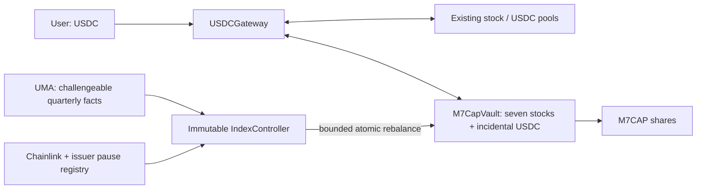

# M7CAP — a helper for direct indexing

M7CAP turns a seven-stock Coinbase basket on Base into one transferable ERC-20 receipt. A user supplies USDC; the gateway buys the required constituent quantities, deposits them in the vault, and mints M7CAP. Redemption reverses that process. Each share represents the same proportion of the actual basket. The gateway charges a small USDC trade fee (1 bp by default, at most 0.10%); in-kind entry and exit through the vault are fee-free.

This repository implements the contracts and operating tools. It has **not been deployed or independently audited**. Live Base integration was tested on a local fork with native B20 execution before the remediation below; that native test has not been re-run against the current code. No live funds were spent. Initial, independently reviewed company-cap observations and operational oracle monitoring are still required before launch.

Two internal reviews, the [first](docs/AUDIT.md) and the [second](docs/AUDIT-2.md), record findings and reproductions. The current code addresses every open finding from both; each document's status section links the fixes to regression tests and lists the residual risks.

## Run it

Requirements: Foundry (tested with Forge 1.5.1), Python 3.9+, and Git for fetching pinned dependencies. No Node packages are required.

```sh
make deps
make check
```

`make check` builds the contracts, checks formatting, and runs Solidity and Python tests. The live-state fork test explicitly skips unless opted in. Solidity is pinned to 0.8.30; dependencies are OpenZeppelin 5.4.0 and forge-std 1.9.7.

For native B20 integration, use [Base's Foundry build](https://github.com/base/base-anvil/releases/tag/v1.1.0), which contains the Base precompiles. Its executable is named `forge`; keep it separate from ordinary Foundry:

```sh
BASE_FORK_TEST=true BASE_FORK_BLOCK=51830602 FOUNDRY_BASE=true \
  "$BASE_FORGE" test --match-contract BaseForkTest -vv
```

`BASE_FORGE` is the path to the Base-aware binary. `BASE_RPC_URL` optionally selects an archive-capable Base endpoint. This command mutates only a local fork, buys the seven B20s from their actual pools, and exercises the real vault and gateway. It neither fabricates B20 balances nor broadcasts transactions. The equal-dollar test seed exercises routing; it is not the proposed market-cap allocation.

Run current read-only integration checks separately:

```sh
python3 scripts/verify_base.py
```

An exit status of 1 outside the execution window, or when no stock feed has updated within the last hour, is expected. The JSON distinguishes integration reads from rebalance eligibility. Historical addresses, source provenance, pool identities, and quotes are in [config/base.json](config/base.json) and [docs/INTEGRATION.md](docs/INTEGRATION.md).

Replay recent execution windows under the controller's oracle rule, as evidence that quarterly rebalancing stays available:

```sh
python3 scripts/feed_availability.py --days 14
```

## Contracts and invariants



- **M7CapVault:** ERC-20 shares plus asset custody. For backing `B[i]` (balance minus amounts owed to earlier redeemers), supply `S`, and shares `q`, minting collects `ceil(B[i]*q/S)` and redemption returns `floor(B[i]*q/S)`. Actual holdings include incidental USDC, preventing cash from becoming unaccounted backing. Shares mint only after exact transfers succeed. In-kind transactions need no price oracle. `redeemBasket` is all-or-nothing. `redeemBasketWithClaims` delivers every leg that can move and turns a leg that cannot (a frozen or paused asset, a blocked receiver) into a claim the redeemer withdraws later; nothing is forfeited. Receipt transfers, mints and redemptions mirror the seven stocks' B20 transfer policies. Each stock trades only through one pinned USDC pool, checked when the vault is constructed.
- **USDCGateway:** exact-output purchases for a requested share count and exact-input sales for redemptions, through the vault's pinned pools; callers do not choose routes. The total spending ceiling or minimum proceeds, both including the fee, protect execution. Unspent USDC returns to the caller. Existing gateway donations cannot be spent or claimed by anyone. The fee is charged on USDC spent and on gross proceeds. The owner, transferable in two steps, can only set the fee between 0 and 10 bp and claim fees already charged. It cannot touch vault assets, routes, donations or user funds.
- **IndexController:** accepts current-quarter quantity-ratio assertions through UMA. A disputed proposal, or an undisputed one still unsettled a day after its challenge window, does not block a replacement; the first proposal to settle true is executed. Execution is permissionless, but the executor supplies no trades. The controller plans every leg from the vault's backing, the accepted ratios and one oracle snapshot:
  - each constituent's quantity share moves at most 5% relative, or 0.25% of NAV if larger, per quarter;
  - every stock is only sold or only bought, sales first;
  - each leg's minimum output is its oracle value less 1%, and total loss is bounded by 1% of traded value;
  - the result must match the stepped target within 30 bp and leave at most 1 bp of NAV in cash.

  There are no arbitrary calls, project admin, upgrade keys, or asset-withdrawal functions.
- **Valuation:** reads total-return feeds once per rebalance and uses that same snapshot for pre/post values. Multipliers are not applied twice. Rebalancing requires issuer feeds unpaused and the sequencer healthy beyond a 1-hour grace period. Every stock price must be at most 25 hours old (the published heartbeat plus an hour), at least one stock price at most 1 hour old as evidence the market is open, and USDC at most 25 hours old. Execution is limited to weekdays 15:00–20:00 UTC. A replay of the ten weekdays to 2026-09-26 found 96% of window slots usable under this rule, against under 1% under the original one-hour rule.

Canonical asset order is **AAPLc, AMZNc, GOOGLc, METAc, MSFTc, NVDAc, TSLAc, USDC**. Stocks have 8 decimals, USDC has 6, M7CAP has 18. M7CAP uses standard ERC-20; B20 is the underlying stock format, not the index accounting mechanism. The core intentionally does not advertise ERC-4626 compliance.

Gateway operations are atomic: a blocked constituent or unfillable swap reverts the entire USDC operation. In-kind holders can instead use `redeemBasketWithClaims`, so one frozen asset never traps the others. Claims are paid before holders' backing but are not protected from issuer seizure of the vault's own holdings. A fully seized-to-zero stock stops new issuance until a rebalance rebuilds it; redemptions reflect remaining holdings.

The initial bootstrap issues 1,000 M7CAP against the supplied basket, permanently locking **10 shares (1% of the seed backing)** at address `0x01`; the seed receiver receives 990 shares. For a $1,000 basket, approximately $10 stays permanently in the vault. The seed funder may initialize only once and has no subsequent authority. The initial share price depends on actual backing, not a guaranteed $1 peg.

Each stock must have at least **10,000 raw units** attributable to those locked shares, computed as `floor(balance * LOCKED_SHARES / totalSupply)`. With eight-decimal stocks, bootstrap therefore needs at least `0.01` of each stock token. The vault checks this precision floor at bootstrap, after any rebalance leg that reduces a stock, and before new issuance. Ordinary minting and redemption cannot lower backing per share. A full circulating-share redemption leaves a meaningful reserve, with less than one basis point of relative rounding error per stock in that redemption, instead of leaving one raw unit of every stock and amplifying the wrong basket on refill. This is a bound on that operation's rounding, not a guarantee against lifetime drift or donations. Issuer seizures below the precision floor stop new issuance; they do not add restrictions to redemption of remaining backing.

## User API

Approve USDC to the gateway for purchases, and M7CAP to the gateway for redemptions. For direct in-kind issuance, approve each component to the vault. `deadline` is a Unix timestamp. Limits use raw token units.

```solidity
vault.quoteMint(sharesOut);               // uint256[8] proportional component inputs
vault.mintBasket(sharesOut, maxAmounts, receiver, deadline);
vault.quoteRedeem(sharesIn);              // uint256[8] component outputs
vault.redeemBasket(sharesIn, minAmounts, receiver, deadline);           // all-or-nothing
vault.redeemBasketWithClaims(sharesIn, minAmounts, receiver, deadline); // defers legs that cannot move
vault.claimOf(owner);                     // uint256[8] deferred amounts owed to `owner`
vault.withdrawClaim(index, amount, to);

gateway.previewFee(usdcAmount);
gateway.mintWithUSDC(sharesOut, maxUSDCIn, receiver, deadline);
gateway.redeemToUSDC(sharesIn, minUSDCOut, receiver, deadline);
```

The gateway returns the USDC actually spent, including the fee, and received, after it. Obtain executable quotes for the vault's current component quantities; a Chainlink reference price is not an executable quote. A USDC-budget UI chooses a share quantity that fits the budget, sets its spending ceiling, and receives any refund. There is no yield strategy, queue, or dedicated M7CAP liquidity pool. Existing DEX fees, price impact, gas, and issuer economics still apply.

M7CAP transfers check the sender, receiver and caller against every stock's B20 transfer policy, so an address an issuer blocks cannot receive, send or redeem M7CAP. Contracts that hold M7CAP, such as pools, must also be authorized. Deferred claims belong to the redeeming address, which may withdraw them to any eligible address once the asset can move.

## Index maintenance

Read [the immutable methodology](docs/METHODOLOGY.md) before constructing observations. It specifies full company capitalization, Alphabet/Meta share classes, quarter-end cutoff, share-count adjustments, matched price/multiplier dates, and exact rounding. Price movements change weights naturally between quarterly reviews; the strategy does not continuously restore stale percentage weights.

```sh
python3 scripts/index_snapshot.py observations.json --canonical-out observations.canonical.json \
  > config/snapshot.json
```

The compiler validates structure and arithmetic, not source truth. Publish the observations, their canonical bytes and the output at a content-addressed (`ipfs://` or `ar://`) location; `sha256sum` of the canonical bytes reproduces the `observation_sha256` asserted on chain. Initial observations are deliberately not fabricated from stock-token supply or substituted with equal weights.

Anyone can propose, settle, or execute. Example simulation commands, after setting the addresses from `.env.example`:

```sh
FOUNDRY_BASE=true "$BASE_FORGE" script script/Maintain.s.sol:Propose --rpc-url "$BASE_RPC_URL"
FOUNDRY_BASE=true "$BASE_FORGE" script script/Maintain.s.sol:Settle --rpc-url "$BASE_RPC_URL"
FOUNDRY_BASE=true "$BASE_FORGE" script script/Maintain.s.sol:Execute --rpc-url "$BASE_RPC_URL"
```

Independently compile the expected snapshot and inspect the current assertion with:

```sh
python3 scripts/watch_index.py --controller "$CONTROLLER" --rpc-url "$BASE_RPC_URL" \
  --expected-snapshot config/snapshot.json
```

This one-shot monitor reports:
- exact ratio and observation-digest differences;
- missing quarterly execution, UMA disputes and challenge expiry;
- unexpected assertion parameters;
- assertions that can never settle because USDC refuses the payee;
- whether a replacement proposal is allowed.

 Exit codes are 0 for a matched/executed state, 1 for operational alerts, and 2 for failed reads. It never fetches evidence URLs or submits disputes. Run it under an external scheduler with alert delivery and independent source review; a successful comparison does not establish that either snapshot is truthful.

The proposal script reads `config/snapshot.json` (including `observation_sha256`), `CONTROLLER`, `PROPOSER`, and a content-addressed `EVIDENCE_URI`. The settle script uses `EXECUTOR` and `ASSERTION_ID`. The execute script takes only `EXECUTOR` and an optional `DEADLINE`: the controller plans every leg on chain, so there is no plan file to go stale. Simulate before broadcasting.

The proposer posts `max(UMA current minimum, immutable bond floor)`; a successful assertion returns the bond to its proposer through UMA. The deployment script defaults the floor to 1,000 USDC, separate from the approximately $1,000 seed backing. Independent reviewers need dispute capital and must monitor the entire 72-hour challenge window. The floor does not automatically grow with TVL. This is an economic security parameter, not a guarantee that false facts will be challenged.

Assertions explicitly use UMA's supported `ASSERT_TRUTH2` identifier. The deployed oracle's `defaultIdentifier()` still returns deprecated `ASSERT_TRUTH`; using that default makes proposals revert. The native fork test caught this incompatibility, and the preflight checks the actual identifier and collateral whitelists. See [UMA's identifier migration](https://docs.uma.xyz/resources/approved-price-identifiers).

A disputed proposal no longer blocks the quarter: anyone may submit a replacement while the dispute resolves, and the first proposal to settle true is executed. This also defeats a dispute naming an address USDC refuses to pay, which UMA can never settle. An undisputed proposal that still cannot settle one day after its challenge window becomes replaceable too. An accepted but unexecuted proposal expires for execution at the next quarter boundary. Holdings and permitted in-kind exits remain intact when updates stall. Bonds can still be settled after quarter-end.

Each quarter moves the basket at most one bounded step toward the accepted ratios. A false assertion that goes unchallenged therefore shifts composition gradually rather than all at once, while a large legitimate change converges over several quarters.

## Deployment workflow

`script/Deploy.s.sol` reads the canonical Base manifest and hashes the exact bytes of `docs/METHODOLOGY.md`. It needs `METHODOLOGY_URI`, a content-addressed copy of those exact bytes, and optionally `FEE_OWNER`, the gateway fee owner, which defaults to the deployer. It predicts the vault's CREATE address to bind the controller immutably without an admin setter. The vault's constructor refuses a controller that is not bound to it, so nonce drift fails the deployment instead of producing a mis-linked system.

```sh
FOUNDRY_BASE=true "$BASE_FORGE" script script/Deploy.s.sol:Deploy --rpc-url "$BASE_RPC_URL"
```

This is a simulation unless `--broadcast` is explicitly added. No production deployment was performed during implementation. Use a Foundry keystore or hardware wallet for an independently reviewed deployment; no private key is required by the repository's test or read tools.

After acquiring the reviewed seven-stock seed basket, copy `config/seed.example.json` to `config/seed.json`, fill the actual vault, receiver, and raw amounts, and simulate `script/Bootstrap.s.sol:Bootstrap`. Before funding, it verifies on chain that the controller is bound to the vault, the valuation exists and matches the vault's assets, every pinned pool exists, and, when `GATEWAY` is set, the gateway is bound to the vault. The seed basket should come from the reviewed cap-weight observations: the first quarter moves each stock at most one bounded step from the seed. Bootstrap transfers all seven assets and issues the initial shares atomically. The approvals may occur in preceding transactions. Public minting remains unavailable until bootstrap succeeds.

Before launch, complete sourced cap-weight observations, independent security review, issuer/wrapper distribution review, actual-address policy checks, current liquidity and feed validation, and independent UMA monitoring. The generic contracts cannot eliminate issuer freeze/seizure, custody, oracle, or Base dependencies. A replaced stock token, retired feed, or unsupported corporate event may require a new deployment and voluntary migration.

## Validation coverage

Tests cover:
- **Accounting:** seed, rounding and donation behavior; pro-rata non-dilution; mixed decimals.
- **Gateway:** refunds and donation isolation; the fee and its owner controls.
- **Transfers and exits:** atomic failed swaps and transfer restrictions; deferred claims; B20 policy mirroring; reentrancy; pinned routes.
- **Governance:** assertion bonds, disputes and replacement rules; Gregorian quarter boundaries.
- **Oracles:** stale, quiet and paused feeds; USDC depeg; sequencer recovery.
- **Planner:** bounded steps, loss and cash bounds, fuzzed against pool deviation and haircuts.

Stateful invariant campaigns check per-share backing, reserves, claims and gateway balances. Opt-in fork tests replay the router-dust and unpayable-dispute scenarios against live Base contracts. The native Base fork additionally tests real B20 transfers, approvals, actual pool routing, and complete USDC entry/exit; it needs Base's patched Forge and has not been re-run since the remediation.

The helper pools assets into one receipt; it does not provide separately registered brokerage positions or per-stock tax-lot control to each holder. Its legal status and distribution depend on the final product structure and applicable issuer terms.
