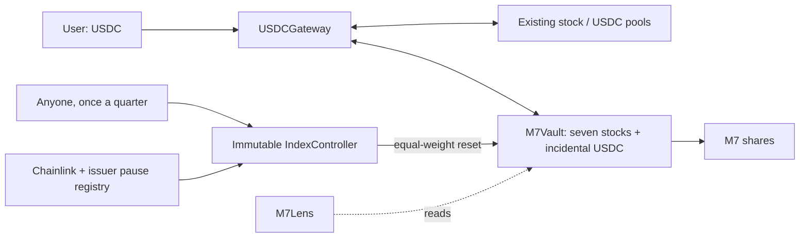

# M7 — seven stocks in equal weight

M7 turns seven Coinbase stock tokens on Base into one transferable ERC-20 receipt that holds them in equal value. A user supplies USDC; the gateway buys the required constituent quantities, deposits them in the vault, and mints M7. Redemption reverses that process. Each share represents the same proportion of the actual basket. Once a quarter, anyone can trigger a reset that trades the basket back to equal weights, planned entirely on chain from oracle prices.

It is free software: no fee, no owner, no admin keys and no upgrades. Users pay only the existing pools' prices and gas, and the vault pays whoever triggers a reset a small, bounded reward.

This repository implements the contracts and operating tools. It has **not been deployed or independently audited**. The current code passes native B20 tests against live Base under both Beryl and Cobalt precompile rules, and a rehearsal of the mainnet runbook on a local fork. No live funds were spent. [docs/DEPLOYMENT.md](docs/DEPLOYMENT.md) is the mainnet runbook, and [docs/METHODOLOGY.md](docs/METHODOLOGY.md) states the rules.

A [third internal review](docs/AUDIT-3.md) covers the current equal-weight code: no path to take or dilute deposits was found, and it records two medium findings about the reset at larger sizes, with reproductions on live Base pools. Two earlier reviews, the [first](docs/AUDIT.md) and the [second](docs/AUDIT-2.md), cover an earlier, cap-weighted design (M7CAP) whose quarterly targets came from UMA assertions; their status sections say which findings still apply.

## Run it

Requirements: Foundry (tested with Forge 1.5.1), Python 3.9+, and Git for fetching pinned dependencies. No Node packages are required.

```sh
make deps
make check
```

`make check` builds the contracts, checks formatting, and runs Solidity and Python tests. The live-state fork tests explicitly skip unless opted in. Solidity is pinned to 0.8.30; dependencies are OpenZeppelin 5.4.0 and forge-std 1.9.7.

For native B20 integration, use Base's Foundry build, [base-anvil](https://github.com/base/base-anvil), which contains the Base precompiles. Install it beside ordinary Foundry, verified against its build attestation, as [the runbook](docs/DEPLOYMENT.md#toolchain) describes. Then:

```sh
BASE_FORK_TEST=true FOUNDRY_BASE=cobalt "$BASE_FORGE" test --match-contract BaseForkTest -vv
```

`BASE_FORGE` is the path to the Base-aware `forge`. `FOUNDRY_BASE` selects the precompile rules: `beryl`, which mainnet runs until 2026-09-30 18:00 UTC, or `cobalt` after that. `BASE_RPC_URL` optionally selects a Base endpoint. The tests mutate only a local fork: they buy the seven B20s from their actual pools, run the real vault, gateway, controller and lens, and reset an unequal basket to equal weights through the live pools. They neither fabricate B20 balances nor broadcast transactions.

`script/rehearse.sh` runs the mainnet runbook against a local base-anvil fork: deploy, verification, seed purchase, bootstrap, smoke tests, the monitor and the first reset.

Run current read-only integration checks separately:

```sh
python3 scripts/verify_base.py
```

An exit status of 1 outside the execution window, or when no stock feed has updated within the last hour, is expected; `--reads-only` exits 0 whenever the read checks pass. `--account` also checks planned addresses, such as the vault and gateway, against every stock's transfer policies. The JSON distinguishes integration reads from reset eligibility, and quotes equal-dollar baskets through the pinned pools. Addresses, source provenance and pool identities are in [config/base.json](config/base.json) and [docs/INTEGRATION.md](docs/INTEGRATION.md).

Replay recent execution windows under the controller's oracle rule, as evidence that quarterly resets stay available:

```sh
python3 scripts/feed_availability.py --days 14
```

## Contracts and invariants



- **M7Vault:** ERC-20 shares plus asset custody. For backing `B[i]` (balance minus amounts owed to earlier redeemers), supply `S`, and shares `q`, minting collects `ceil(B[i]*q/S)` and redemption returns `floor(B[i]*q/S)`. Actual holdings include incidental USDC, preventing cash from becoming unaccounted backing. Shares mint only after exact transfers succeed. In-kind transactions need no price oracle. `redeemBasket` is all-or-nothing. `redeemBasketWithClaims` delivers every leg that can move and turns a leg that cannot (a frozen or paused asset, a blocked receiver) into a claim the redeemer withdraws later; nothing is forfeited. Receipt transfers, mints and redemptions mirror the seven stocks' B20 transfer policies. Each stock trades only through one pinned USDC pool, checked when the vault is constructed. Only the controller can trade vault assets, and only the controller can pay the reset reward, in USDC, never from deferred claims.
- **USDCGateway:** exact-output purchases for a requested share count and exact-input sales for redemptions, through the vault's pinned pools; callers do not choose routes. The total spending ceiling or minimum proceeds protect execution. Unspent USDC returns to the caller. The gateway has no owner and charges no fee, and USDC donated to it can never be spent or withdrawn.
- **IndexController:** resets the vault to equal value once per calendar quarter. Anyone may call `rebalance(deadline, rewardTo)`; the caller supplies no trades. The controller plans every leg from the vault's backing and one oracle snapshot:
  - targets are equal value at that snapshot, and a reset may at most double a stock's quantity share;
  - every stock is only sold or only bought, sales first;
  - each leg's minimum output is its oracle value less 1%, total loss is bounded by 1% of traded value plus the reward, and selling more than half of NAV is refused;
  - the result must match the target within 30 bp and leave at most max(1 bp of NAV, $0.07) in cash; within 10 bp nothing trades;
  - a reset that trades pays `rewardTo` min(0.5 bp of NAV, $25) in USDC, funded pro rata by every stock.

  There are no arbitrary calls, admin, upgrade keys, or asset-withdrawal functions.
- **Valuation:** reads total-return feeds once per reset and uses that same snapshot for targets and for the before and after values. Multipliers are not applied twice. A reset requires issuer feeds unpaused and the sequencer healthy beyond a 1-hour grace period. Every stock price must be at most 25 hours old (the published heartbeat plus an hour), at least one stock price at most 1 hour old as evidence the market is open, and USDC at most 25 hours old. Resets are limited to weekdays 15:00–20:00 UTC. A replay of the ten weekdays to 2026-09-26 found 96% of window slots usable under this rule.
- **M7Lens:** a read-only view of price per share and total value from the latest oracle prices; it can be redeployed at any time.

Canonical asset order is **AAPLc, AMZNc, GOOGLc, METAc, MSFTc, NVDAc, TSLAc, USDC**. Stocks have 8 decimals, USDC has 6, M7 has 18. M7 uses standard ERC-20; B20 is the underlying stock format, not the index accounting mechanism.

M7 deliberately does not implement ERC-4626. That standard assumes one underlying asset, with deposits, withdrawals and `convertToAssets` in that asset and previews exact for the current block. An M7 share is backed by seven stocks plus incidental cash, in-kind entry takes all of them in proportion, and the USDC route runs seven pool swaps whose results no view function can compute exactly. Presenting USDC as the asset would turn `convertToAssets` into an oracle estimate that integrators treat as exact. The multi-asset variants do not fit either: ERC-7575 still enters through one asset at a time, and ERC-7540 covers asynchronous requests. As a plain ERC-20, M7 works with any wallet, exchange or bridge.

Gateway operations are atomic: a blocked constituent or unfillable swap reverts the entire USDC operation. In-kind holders can instead use `redeemBasketWithClaims`, so one frozen asset never traps the others. Claims are paid before holders' backing but are not protected from issuer seizure of the vault's own holdings. A fully seized-to-zero stock stops new issuance until a reset rebuilds it; redemptions reflect remaining holdings.

The initial bootstrap issues 1,000 M7 against the supplied basket, permanently locking **10 shares (1% of the seed backing)** at address `0x01`; the seed receiver receives 990 shares. For a $125 basket, about $1.25 stays permanently in the vault. The seed funder may initialize only once and has no subsequent authority. The initial share price depends on actual backing, not a guaranteed peg.

Each stock must have at least **10,000 raw units** attributable to those locked shares, computed as `floor(balance * LOCKED_SHARES / totalSupply)`. With eight-decimal stocks, bootstrap therefore needs at least `0.01` of each stock token, about $53 of seed at current prices. The vault checks this precision floor at bootstrap, after any reset leg that reduces a stock, and before new issuance. Ordinary minting and redemption cannot lower backing per share. Issuer seizures below the precision floor stop new issuance; they do not add restrictions to redemption of remaining backing.

## User API

Approve USDC to the gateway for purchases, and M7 to the gateway for redemptions. For direct in-kind issuance, approve each component to the vault. `deadline` is a Unix timestamp. Limits use raw token units.

```solidity
vault.quoteMint(sharesOut);               // uint256[8] proportional component inputs
vault.mintBasket(sharesOut, maxAmounts, receiver, deadline);
vault.quoteRedeem(sharesIn);              // uint256[8] component outputs
vault.redeemBasket(sharesIn, minAmounts, receiver, deadline);           // all-or-nothing
vault.redeemBasketWithClaims(sharesIn, minAmounts, receiver, deadline); // defers legs that cannot move
vault.claimOf(owner);                     // uint256[8] deferred amounts owed to `owner`
vault.withdrawClaim(index, amount, to);

gateway.mintWithUSDC(sharesOut, maxUSDCIn, receiver, deadline);
gateway.redeemToUSDC(sharesIn, minUSDCOut, receiver, deadline);

controller.rebalanceDue();                // whether this quarter's reset has yet to run
controller.rebalance(deadline, rewardTo); // anyone; rewardTo = address(0) declines the reward

lens.pricePerShare();                     // USD per whole M7 (18 decimals), stalest price time
lens.totalValue();                        // USD value of all backing (18 decimals), stalest price time
lens.value();                             // plus NAV, supply, per-asset values, pause and sequencer flags
```

The gateway returns the USDC actually spent and received. `M7Lens` reports the value of a share, and of the whole vault, from the latest oracle prices at any time; unlike the reset's valuation it applies no trading window or staleness rule, and it returns the time of its stalest price instead. Stock feeds stand still outside market hours, so treat it as a display price, not a lending or liquidation price. Obtain executable quotes for the vault's current component quantities; a Chainlink reference price is not an executable quote. A USDC-budget UI chooses a share quantity that fits the budget, sets its spending ceiling, and receives any refund; wallets should pad gas estimates for the seven-swap gateway calls. There is no yield strategy, queue, or dedicated M7 liquidity pool. Existing DEX fees, price impact, gas, and issuer economics still apply.

M7 transfers check the sender, receiver and caller against every stock's B20 transfer policy, so an address an issuer blocks cannot receive, send or redeem M7. Contracts that hold M7, such as pools, must also be authorized. Deferred claims belong to the redeeming address, which may withdraw them to any eligible address once the asset can move.

## Quarterly reset

Between resets the token quantities stay fixed and weights drift with prices. The reset needs no data beyond on-chain prices, so it can run without anyone's permission:

```sh
FOUNDRY_BASE=cobalt "$BASE_FORGE" script script/Maintain.s.sol:Rebalance --rpc-url "$BASE_RPC_URL"
```

The script reads `CONTROLLER`, `EXECUTOR`, an optional `REWARD_TO` (default the executor) and an optional `DEADLINE`, and refuses if this quarter's reset already ran. Simulate before broadcasting. A reset that reverts (outside the window, stale prices, a pool too far from its oracle price) changes nothing and can be retried later in the quarter; if a quarter passes without one, the basket simply keeps its quantities.

Each trading reset costs holders the pools' fees and price impact on its turnover, typically 5–15% of the vault's value per quarter, plus the reward: 0.5 bp of NAV, at most $25. The reward is small until the vault is large, so bots may not trigger resets for a small vault; anyone can trigger one by hand. `scripts/monitor.py` alerts when a quarter's reset is still undone a week in, and as critical with 21 days or fewer left; see [Monitoring](docs/DEPLOYMENT.md#monitoring).

## Deployment workflow

[docs/DEPLOYMENT.md](docs/DEPLOYMENT.md) is the step-by-step mainnet runbook: roles and funding, the Cobalt go/no-go, deploy, seed, smoke tests, the first reset, monitoring and the incident playbook. The tools it uses:

- `script/Deploy.s.sol` deploys the Valuation, controller, vault, gateway and lens. The controller is bound to the vault by CREATE address prediction, and the vault's constructor refuses a controller that is not bound to it, so nonce drift fails the deployment instead of producing a mis-linked system.
- `scripts/verify_deployment.py` checks every deployed immutable, binding and runtime bytecode before any funds go in, checks the state after the bootstrap, and writes the deployment record.
- `scripts/seed_basket.py` sizes an equal-value seed at current prices, so the first reset has little to do.
- `script/AcquireSeed.s.sol` buys the seed through the vault's pinned pools at no more than oracle value plus 1%. `script/Bootstrap.s.sol` re-verifies the linkage and deposits the seed atomically.

Scripts that touch B20 tokens need Base's Foundry build. Without `--broadcast` they only simulate. Use a hardware wallet or an encrypted Foundry keystore; no private key is required by the repository's tests or read tools.

The generic contracts cannot eliminate issuer freeze/seizure, custody, oracle, or Base dependencies. A replaced stock token, retired feed, or unsupported corporate event may require a new deployment and voluntary migration.

## Validation coverage

Tests cover:
- **Accounting:** seed, rounding and donation behavior; pro-rata non-dilution; mixed decimals.
- **Gateway:** refunds, donation isolation, and never retaining user funds.
- **Transfers and exits:** atomic failed swaps and transfer restrictions; deferred claims; B20 policy mirroring; reentrancy; pinned routes.
- **Reset:** once per quarter; the price window and oracle gates; equal-value targets; the step limit on extreme moves; loss, compliance, cash and turnover bounds; small vaults; the reward's size, cap, funding and limits; Gregorian quarter boundaries.
- **Oracles:** stale, quiet and paused feeds; USDC depeg; sequencer recovery.

A fuzz campaign resets the basket after random ±20% price moves against pools that deviate from the oracle and keep a haircut. Stateful invariant campaigns check per-share backing, reserves, claims and gateway balances. Opt-in fork tests replay the router-dust scenario against live Base contracts. The native Base fork additionally tests real B20 transfers and policies, actual pool routing, complete USDC entry and exit, the lens, and a reset through the live pools; it needs Base's Foundry build and passes under both Beryl and Cobalt rules. `script/rehearse.sh` rehearses the deployment end to end.

The helper pools assets into one receipt; it does not provide separately registered brokerage positions or per-stock tax-lot control to each holder. Its legal status and distribution depend on the final product structure and applicable issuer terms.
